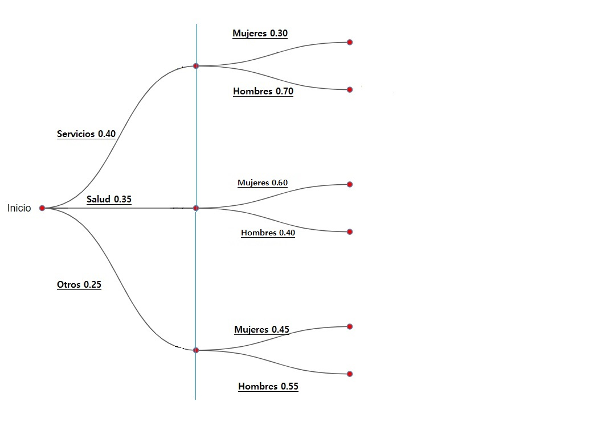
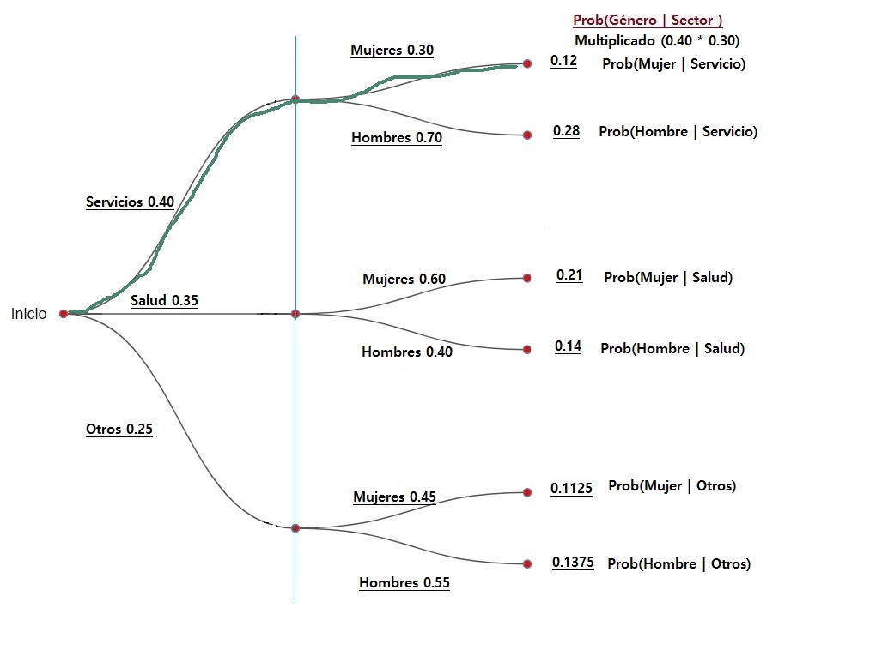
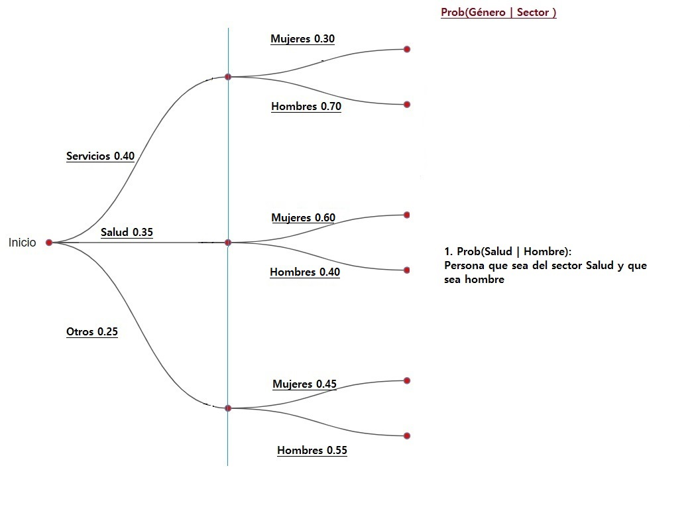
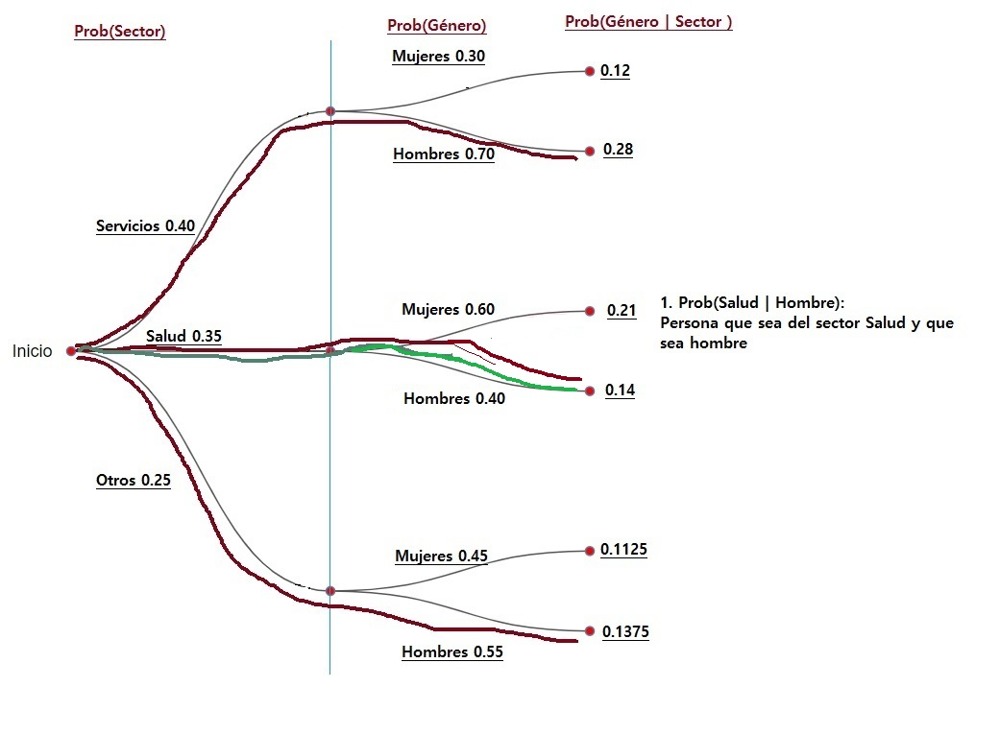
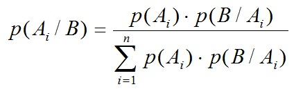

# Objetivo

Realizar cálculo de probabilidades implementanto Teorema de Bayes

# Descripción

Caso: personas que trabajan en sectores y sean mujeres y hombres

Las personas de cualquier género trabajan en algún sector, en función del género determinado de manera inicial se trata de encontrar la probabilidad del sector en donde laboran.

Al elegir aleatoriamente a una persona se conoce el género, Hombre o Mujer y se solicita encontrar la probabilidad de que pertenezca a algún sector.

# Desarrollo

## Librerías utilizadas

```{r}
library(knitr)

```

## Las probabilidades

Se trata de encontrar las probabilidades condicionales usando el Teorema de Bayes para personas que trabajan en algún sector ('Servicios', 'Salud' u 'Otros') y sean o que estén en función de algún género ('Hombre' o 'Mujer').

### Evento sectores

-   Existen tres sectores en donde trabajan las personas

-   Hay una probabilidad de que en el sector servicios trabaje $40\% (0.40)$ de las personas

-   Hay una probabilidad de que en el sector salud trabaje $35\% (0.35)$ de las personas

-   Hay una probabilidad de que en el sector otros trabaje $25\% (0.25)$ de las personas

-   La suma debe dar $100\%$ o $1$

-   Las variables en R

    -   Prob.Servi $= 0.40$
    -   Prob.Salud $= 0.35$
    -   Prob.Otros $= 0.25$

```{r}
Prob.Servi <- 0.40
Prob.Salud <- 0.35
Prob.Otros <- 0.25

cat("Las probabilidades por cada servicio")
Prob.Servi; Prob.Salud; Prob.Otros 
```

### Eventos Mujeres y Hombres

Se dan las probabilidades de que sea de algún género en función del servicio.

### Sector Servicios

-   En el sector Servicios la probabilidad de que sea Mujer es del $0.30$

-   En el sector Servicios la probabilidad de que sea Hombre es del $0.70$

    -   PServ.Mujer
    -   PServ.Hombre

    ```{r}
    PServ.Mujer <- 0.30
    PServ.Hombre <- 0.70

    ```

### Sector Salud

-   En el sector Salud la probabilidad de que sea Mujer es del $0.60$

-   En el sector Salud la probabilidad de que sea Hombre es del $0.40$

    -   PSalud.Mujer $= 0.60$
    -   PSalud.Hombre $= 0.40$

    ```{r}
    PSalud.Mujer <- 0.60
    PSalud.Hombre <- 0.40

    PSalud.Mujer; PSalud.Hombre
    ```

### Sector Otros

-   En el sector Otros la probabilidad de que sea Mujer es del $0.45$

-   En el sector Otros la probabilidad de que sea Hombre es del $0.55$

    -   POtros.Mujer = 0.45
    -   POtros.Hombre = 0.55

    ```{r}
    POtros.Mujer <- 0.45
    POtros.Hombre <- 0.55

    POtros.Mujer; POtros.Hombre
    ```

### Arbol de Probabilidades


```{r}
# 
```

### Cálculo de probabilidades

Se muestran las probabilidades condicionales del género en función del sector.


```{r}
#
```

Con línea verde se indica el primer cálculo multiplicando las probabilidades conforme y de acuerdo a la fórmula de la Ley Multiplicación para el cálculo de probabilidad condicional para eventos independientes.

```{r}

```

### Ley de Multiplicación

La Ley de la Multiplicación es útil para calcular la probabilidad de la intersección de dos eventos.

La ley de la multiplicación se basa en la definición de probabilidad condicional.

Se multiplican las probabilidades, y en este caso tendiendo las probabilidades identificadas en el árbol se determinan fácilmente.

### Probabilidad de que sea Hombre o Mujer en función de Servicios

-   ProbServ.I.Mujer \<- Prob.Servi \* PServ.Mujer
-   ProbServ.I.Hombre \<- Prob.Servi \* PServ.Hombre

```{r}
ProbServ.I.Mujer <- Prob.Servi * PServ.Mujer
ProbServ.I.Hombre <- Prob.Servi * PServ.Hombre

ProbServ.I.Mujer ; ProbServ.I.Hombre

```

### Probabilidad de que sea Hombre o Mujer en función de Salud

-   ProbSalud.I.Mujer \<- Prob.Salud \* PSalud.Mujer
-   ProbSalud.I.Hombre \<- Prob.Salud \* PSalud.Hombre

```{r}
ProbSalud.I.Mujer <- Prob.Salud * PSalud.Mujer
ProbSalud.I.Hombre <- Prob.Salud * PSalud.Hombre

ProbSalud.I.Mujer ; ProbSalud.I.Hombre

```

### Probabilidad de que sea Hombre o Mujer en función de Otros

-   $ProbOtros.I.Mujer = Prob.Otros * POtros.Mujer$
-   $ProbOtros.I.Hombre = Prob.Otros * POtros.Hombre$

```{r}
ProbOtros.I.Mujer <- Prob.Otros * POtros.Mujer
ProbOtros.I.Hombre <- Prob.Otros * POtros.Hombre

ProbOtros.I.Mujer ; ProbOtros.I.Hombre

```

## Ejercicios probabilidad

Ya se encontró en el apartado anterior las probabilidades condicionales de que una persona siendo de algún sector sea posteriormente hombre o mujer y eso se determinó conforme a la Ley Multiplicativa para eventos Independientes.

Ahora se elige aleatoriamente a una persona se conoce el género, Hombre o Mujer y se solicita encontrar la probabilidad de que pertenezca a algún sector.

Se pide encontrar las probabilidades siguientes:

-   

    1.  Prob(Salud \| Hombre): Persona que sea del sector Salud y que sea hombre

-   

    2.  Prob(Salud \| Mujer): Persona que sea del sector Salud y que sea Mujer

-   

    3.  Prob(Servicios \| Hombre): Persona que sea del sector Servicios y que sea Mujer

-   

    4.  Prob(Servicios \| Mujer): Persona que sea del sector Servicios y que sea Mujer

-   Notar que en el árbol siguiente el orden de la probabilidad es invertido en relación a la imagen del árbol anterior, por lo que es necesario usar la Fórmula de Bayes.

    

```{r}
# 
```

Con el siguiente árbol se identifica con línea verde la probabilidad a encontrar la respuesta a la pregunta uno: **1. Prob(Salud \| Hombre): Persona que sea del sector Salud y que sea hombre**

Con línea roja en el árbol se identifica las distintas probabilidades de que sea de cualquier sector dado que sea Hombre


```{r}

```

### Calculando la probabilidad por Teorema de Bayes

```{r}
# 
```

$$p(A_i|B) = \frac{p(A_i) \cdot p(B|A_i)}{\sum_{i=1}^np(A_i) \cdotp(B|A_i)}$$ $$\therefore$$

$$\frac{ProbSalud.I.Hombre}{(ProbServ.I.Hombre + ProbSalud.I.Hombre + ProbOtros.I.Hombre)}$$

### Prob(Salud \| Hombre): Persona que sea del sector Salud y que sea hombre

Se muestra la Fórmula de Bayes y se sustituyen valores para dar respuesta a la preguna uno: **1. Prob(Salud \| Hombre): Persona que sea del sector Salud y que sea hombre**

Ya se tiene el **numerador** con la probabilidad condicional de que sea Hombre dado que sea del sector Salud: ProbSalud.I.Hombre. Camino [verde]{style="color:green"} en el árbol.

Ahora se suman las probabilidades en donde aparezca Hombre dado cualquier sector y se tiene el **denominador**. Todas los contornos [rojos]{style="color:red"} en el árbol.

La probabilidad de que una persona sea del sector Salud dado que se Hombre es:

```{r}
TBResult <- ProbSalud.I.Hombre / (ProbServ.I.Hombre + ProbSalud.I.Hombre + ProbOtros.I.Hombre)

TBResult

cat ("1. Prob(Salud | Hombre): Persona que sea del sector Salud y que sea hombre es: ", TBResult)

```

Se concluye que en el experimento de elegir a una persona al azar y que ya se conoce que **'Hombre'**, entonces se determina mediante el Teorema y la Fórmula de Bayes la probababilidad de que una persona sea del sector **'Salud'** dado que sea apriori **'Hombre'**

La probabilidad es de **0.2511** o sea del **25.11%** que significa que si se elige a una persona y es **'Hombre'** hay una probabilidad del **25.11%** de que sea del sector **'Salud'**

### 

### Prob(Salud \| Mujer): Persona que sea del sector Salud y que sea Mujer

Describir de manera concluyente a cada pregunta de probabilidad

Aplicando la regla de Bayes $$prob = \frac{p(Salud) \cdot p(SaludMujeres)}{p(Servicios) \cdot p(ServiciosMujeres) + p(Salud) \cdot p(SaludMujeres) + p(Otros) \cdot p(OtrosMujeres)}$$

```{r}
prob <- (Prob.Salud * PSalud.Mujer) / (sum(Prob.Servi * PServ.Mujer, Prob.Salud * PSalud.Mujer, Prob.Otros * POtros.Mujer))

paste ("La probabilidad de que una persona sea del sector Salud dado que sea Mujer es:", round(prob * 100, 2), "%")
```

### Prob(Servicios \| Hombre): Persona que sea del sector Servicios y que sea Hombre

Pendiente

### Prob(Servicios \| Mujer): Persona que sea del sector Servicios y que sea Mujer

Pendiente

# Interpretación

Pendiente

# Bibliografía

# 
